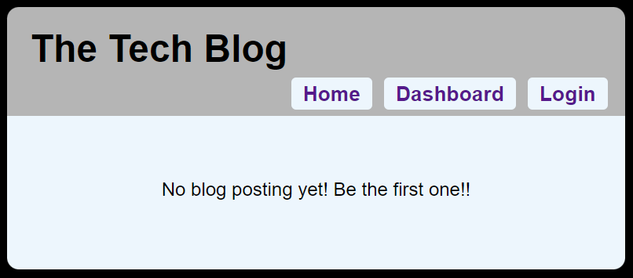

# Simple-tech-blog

## Description
This web application is a CMS-style blog site, where developers can pushlish their blog posts and comment on other developers posts. This app follows the MVC(Model-View-Contoroller) paradigm in its architectual structure, using Handlebars.js, Sequelize, and the express-session npm package for authentication.

## Table of Contents

- [Usage](#usage)
- [Tests](#tests)
- [Credit](#credit)
- [Questions](#questions)

## Usage
- The URL of the Deployed page:  
https://mo-tech-blog.herokuapp.com/

- The URL of the GitHub repository:  
https://github.com/morisky78/simple-tech-blog

### Initial pages, login, signup page.
When there is no blog posting, pages will are as shown below:  

 
 

### Homepage
The homepage presents existing blog posts, latest first.  
When we click a blog, users can see details of the blog posting and comments.  
When user is logged in, they can leave a comment and **update/delete their own comment** on this page.  
 
 

### Dashboard
On the dashboard page, users can see any own blog post listing. Users can create a new posting, and edit/delete an existing blog.  
 
 

### Signout
When a user is idle on the site for 2 hours, the user will be logged out and prompted to log in again before they can add, update, or delete blog postings or comments

## Credits
Handlebars
https://handlebarsjs.com/guide/

## Questions
If you have any questions, please contact me moran.risk78@gmail.com  
GitHub  profile: [morisky78](https://github.com/morisky78)